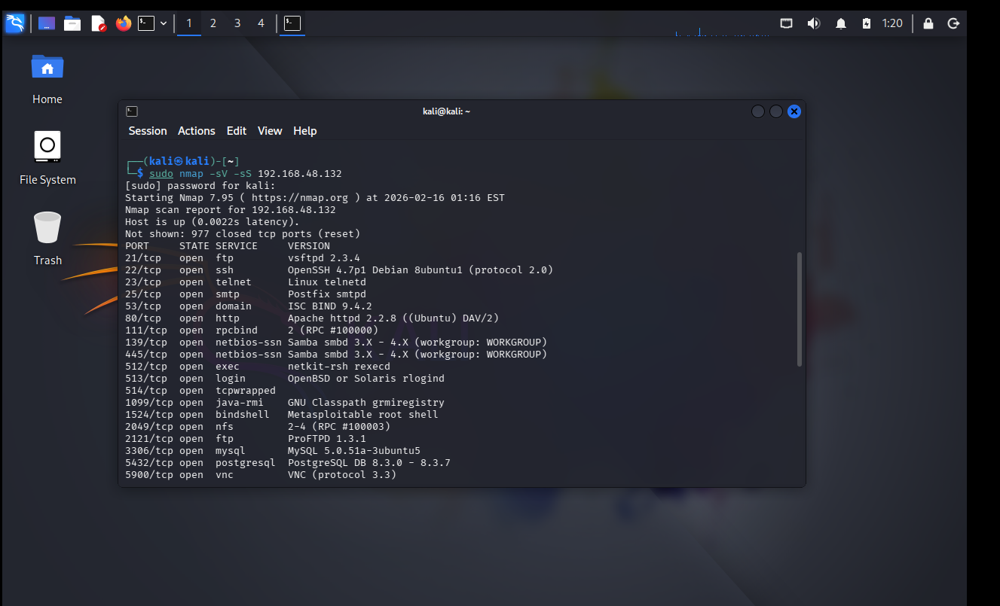
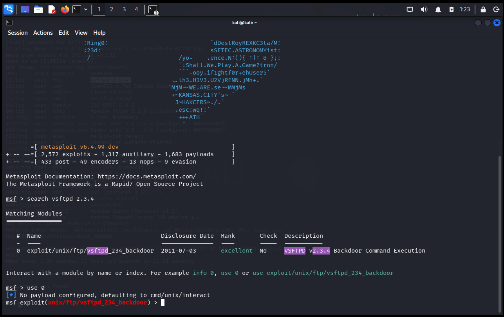
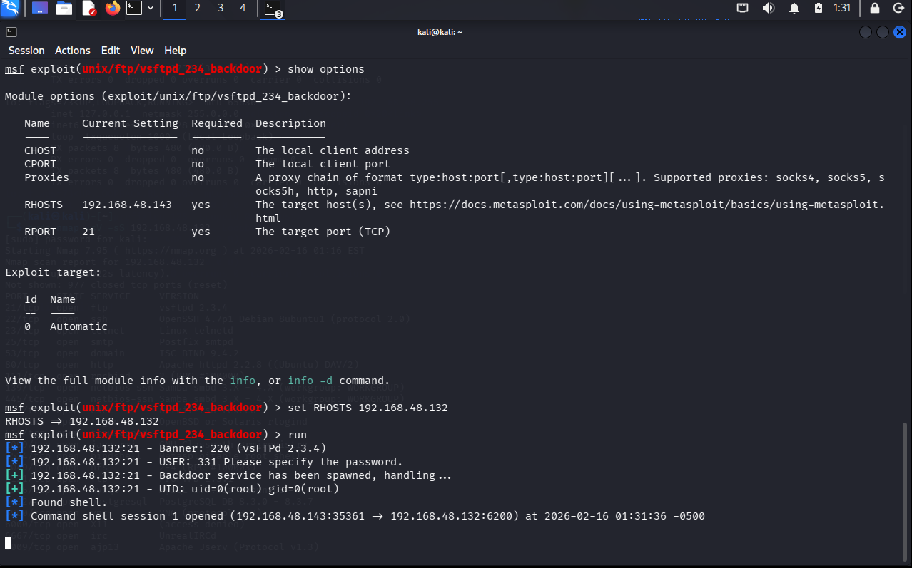
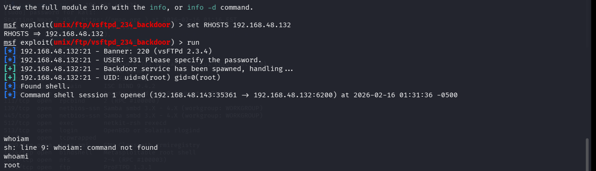
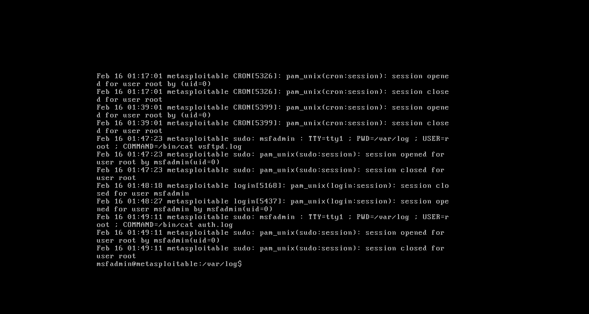
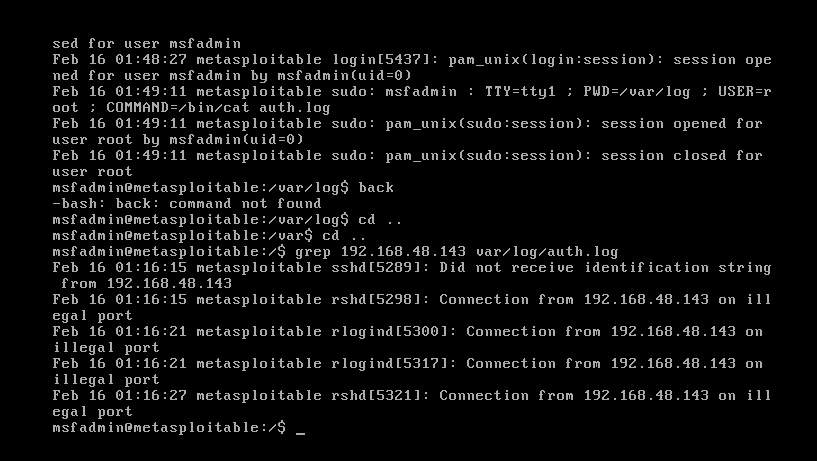
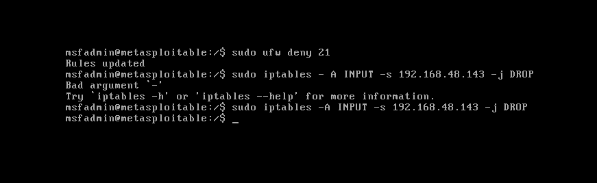
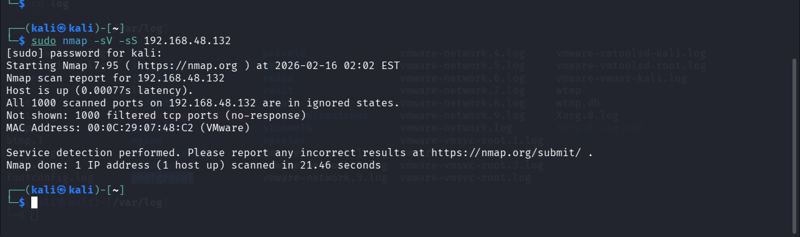

# 🔥 Red Team vs Blue Team – Breach & Defend Lab

👨‍💻 Author: Aniket Pawar  
🎯 Project Type: Attack & Defense Simulation  
🛠 Environment: Kali Linux + Metasploitable 2  

---

# 📌 Executive Summary

This project demonstrates a real-world cyber attack lifecycle against a vulnerable FTP service (vsftpd 2.3.4) and the defensive measures taken to detect and mitigate the attack.

The objective was to simulate both:
- 🔴 Red Team (Attacker)
- 🔵 Blue Team (Defender)

---

# 🏗 Lab Architecture

Attacker Machine: Kali Linux  
Target Machine: Metasploitable 2  
Network: Internal Virtual Network  

---

# 🔥 Red Team vs Blue Team – Breach & Defend Lab

---

## 📌 Project Overview
This project demonstrates a real-world cyber attack and defense simulation using Metasploitable 2.

---

## 🔍 1️⃣ Nmap Reconnaissance

Identified vsftpd 2.3.4 running on port 21.

---

## 💥 2️⃣ Exploitation – Metasploit

Used exploit/unix/ftp/vsftpd_234_backdoor to gain access.

---

## 👑 3️⃣ Root Access

Successfully gained root shell access.

---

## 🛡 4️⃣ Log Detection

Suspicious attacker IP detected in auth.log.

---

## 🚫 5️⃣ Firewall Remediation

Blocked attacker IP using iptables.

---

## 🔎 6️⃣ Validation Scan

All ports filtered after firewall rule implementation.

---

# 🧠 MITRE ATT&CK Mapping

| Phase | Technique |
|-------|-----------|
| Reconnaissance | Active Scanning |
| Initial Access | Exploit Public-Facing Application |
| Privilege Escalation | Command Shell |
| Defense Evasion | Abuse of Backdoor Service |

---

# 🛠 Tools Used

- Nmap
- Metasploit Framework
- Linux Log Analysis
- iptables Firewall
- VirtualBox / VMware

---

# 📊 Skills Demonstrated

✔ Vulnerability Assessment  
✔ Exploitation Techniques  
✔ Log Analysis  
✔ Incident Response  
✔ Firewall Configuration  
✔ Attack Lifecycle Understanding  

---

# 🎯 Outcome

This lab successfully demonstrates:

- Complete attack chain execution
- Log-based detection
- Defensive remediation
- Validation of security controls

---

# ⚠ Disclaimer

This project was conducted in a controlled lab environment for educational purposes only.

